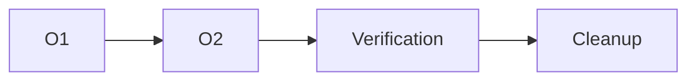

# `<Objective>` — Assured Execution Ledger Overlay

> **Assured is an overlay, not a topology.** Attach this ledger to either a Direct trace or a Parallel plan. Set `Base topology` to `Direct` or `Parallel`; choose the project consultation tier independently. This ledger adds full traceability, state proofs, threat handling, rollback/cleanup, and external-effect readbacks. It does not authorize scope expansion, change routing, or replace deterministic verification.

## 1. Ledger identity and invariants

| Field | Value |
|---|---|
| Ledger ID | `<stable project/ledger ID>` |
| Work-item identity | `work_id: w:<plan-id>:<task-id>`; `attempt_id: <work-id>@a<N>`; native transport IDs recorded per attempt |
| Lifecycle contract | `planned → ready → dispatched → running → handoff_pending → verified`; terminal/exception states preserved; see `references/work-item-lifecycle.md` |
| Base plan/trace | `<linked compact-direct-trace.md or parallel-plan.md ID>` |
| Base topology | `Direct \| Parallel` |
| Execution transport | `controller \| delegate_task \| kanban \| mixed-by-lane` |
| Consultation tier | `exempt \| standard \| broad \| high-risk` |
| Assured overlay | `ON` |
| Revision | `Revision 0 — Baseline and Assurance Contract` |
| Status | `PLANNING \| EXECUTING \| VERIFYING \| COMPLETE \| BLOCKED \| ABORTED` |
| Accountable controller | `<owner/controller>` |
| Capacity source | `<live tool/config readback; N/A for Direct>` |
| Created / updated | `<ISO timestamps>` |

### Assurance invariants

- [ ] Scope, exclusions, assumptions, and authoritative sources are recorded before mutation or dispatch.
- [ ] Every requirement maps to a deliverable and verification, and every deliverable maps back to a requirement.
- [ ] Every task/operation has one owner, exact resource boundaries, dependencies, acceptance, rollback/cleanup, and evidence fields.
- [ ] No task becomes `verified` from a worker claim or successful mutation alone; controller verification is required.
- [ ] Every external mutation is read back from the authoritative target.
- [ ] Unknown identity, artifact, dependency, side-effect, or cleanup state fails closed.
- [ ] High-risk consultation fingerprints match the final accepted artifact.
- [ ] No fixed duration target is used; state transitions are evidence-gated.

If any invariant is unchecked, the corresponding gate is `BLOCKED`.

## 2. Objective, scope, and assurance boundary

**Requested outcome:**  
`<one observable final result>`

**Assurance objective:**  
`<what must be provable in addition to the base topology's normal acceptance>`

### In scope

- `<deliverable, state transition, resource, or external effect>`

### Exclusions

- `<explicitly excluded action, environment, account, device, or deployment>`

### Authoritative sources and identity

| Source ID | Source/target | Authority type | Identity/fingerprint/readback | Last verified | Owner |
|---|---|---|---|---|---|
| S1 | `<relative path, record, service, device, URL, or handle>` | `requirement \| artifact \| runtime \| external system` | `<SHA-256, ID, query, or handle>` | `<ISO timestamp>` | `<owner>` |

### Assumptions and fail-closed conditions

| ID | Assumption | Evidence | Impact if false | Resolution owner | State |
|---|---|---|---|---|---|
| A1 | `<assumption>` | `<source/readback>` | `<specific safety or completion impact>` | `<owner/user>` | `open \| confirmed \| rejected` |

## 3. Requirement-to-evidence traceability

| Requirement ID | Requirement | Source | Deliverable/operation IDs | Acceptance gate | Evidence handle | Status |
|---|---|---|---|---|---|---|
| RQ-01 | `<requirement>` | `<authoritative source>` | `<D/W/T or O IDs>` | `<binary check>` | `<pending/path/hash/query>` | `planned \| verified \| blocked` |

**Traceability gate:** `PASS` only when every requirement has at least one operation and one controller-verifiable evidence item, and every operation maps to a requirement or is explicitly marked safety/cleanup work.

## 4. Decomposition, operation registry, and cards

Use the base plan's task tree when it exists. If the base trace is Direct, decompose only where it improves assurance; do not create artificial parallelism. Any newly created operation must be atomic, owned, dependency-linked, and independently verifiable.

### Decomposition tree

```text
L0 Objective
├── D1 Deliverable
│   ├── O1 Atomic operation
│   └── O2 Atomic operation
└── G1 Assurance/cleanup gate
    └── O3 Atomic operation
```

**Completeness rationale:** `<why children cover the objective without overlap or hidden work>`

### Operation/task registry

| Operation ID | Work ID | Attempt ID | Parent | Requirement IDs | Type | Outcome | Depends on | Unlocks | Owner | Mutable resources | Acceptance | Rollback/cleanup | Status | Revision |
|---|---|---|---|---|---|---|---|---|---|---|---|---|---|---|
| O1 | `w:<plan>:O1` | `@a1` | `<parent>` | `RQ-01` | `work \| verify \| rollback \| cleanup \| consultation` | `<one outcome>` | `—` | `<IDs>` | `<owner>` | `<exact resources>` | `<binary check>` | `<action or N/A>` | `planned \| ready \| dispatched \| running \| handoff_pending \| verified \| blocked \| failed \| cancel_requested \| cancelled \| unknown \| superseded` | `R0` |

### Operation card schema

Repeat for every operation, including verification, consultation, rollback, and cleanup operations.

#### `<OPERATION-ID>` — `<name>`

- **Work ID / attempt:** `w:<plan-id>:<task-id> / <work-id>@a<N>`
- **Requirement(s):** `<RQ IDs or SAFETY/CLEANUP>`
- **Revision:** `<Revision N — milestone>`
- **Native transport identity:** `<delegation/subagent or Kanban board/card/run/idempotency>`
- **Objective:** `<one concrete outcome>`
- **Authoritative inputs:** `<exact sources and pre-state readbacks>`
- **Dependencies:** `<operation IDs and verified outputs>`
- **May read:** `<exact resources>`
- **May modify:** `<exact resources>`
- **Must not modify:** `<siblings, secrets, global configuration, or exclusions>`
- **Expected pre-state:** `<identity, hash, version, status, or N/A>`
- **Deliverable/side effect:** `<artifact or observable state>`
- **Acceptance criteria:**
  - [ ] `<binary criterion>`
  - [ ] `<binary criterion>`
- **Verification:** `<exact command/query/readback>`
- **Failure impact:** `<what remains valid; what becomes blocked>`
- **Rollback:** `<exact reversible action, compensating action, or not reversible>`
- **Cleanup/teardown:** `<exact action, owner, and evidence>`
- **Owner:** `<single accountable owner>`
- **Status:** `<allowed status>`
- **Evidence:** `<pending or exact evidence>`

## 5. Dependency DAG and state gates

### DAG



**Actual edges:** `<one verified edge per line: Oa -> Ob>`

- [ ] Every edge names existing operations.
- [ ] The graph is acyclic.
- [ ] A `ready` operation has all dependencies `verified` and all preconditions verified.
- [ ] Verification, rollback, and cleanup operations are not hidden inside a work operation.
- [ ] External side effects cannot be considered complete before their readback operation is `verified`.

### State model

Use these states consistently:

- **Plan state:** `PLANNING -> EXECUTING -> VERIFYING -> COMPLETE`, with `BLOCKED` or `ABORTED` terminal alternatives.
- **Work-item state:** `planned -> ready -> dispatched -> running -> handoff_pending -> verified`; exception/terminal states are `blocked`, `failed`, `cancel_requested`, `cancelled`, `unknown`, and `superseded`. A worker summary or Kanban `done` enters only `handoff_pending`; controller evidence alone enters `verified`.
- **Attempt rule:** a successor after dispatch/running must have a new attempt ID, fenced predecessor, preserved evidence, resource/external readback, and revalidated ownership. `unknown` freezes dependents; it is never success.
- **Effect state:** `not-proposed -> proposed -> applied-unverified -> verified`, or `rollback-required -> rolled-back -> readback-verified`; `unknown` is never success.
- **Consultation state:** `not-eligible -> eligible -> dispatched -> success \| unavailable \| failed`; required non-success blocks completion unless the tier's permitted fallback/user waiver is recorded.

Every transition records timestamp, actor, reason, predecessor state, successor state, native transport identity, and evidence handle.

## 6. Ownership and capability boundaries

| Resource/capability | Read owner(s) | Mutation owner | Allowed operation IDs | Isolation/conflict control | Revocation/cleanup owner |
|---|---|---|---|---|---|
| `<path, record, account, device, process, token-like capability, or service>` | `<IDs>` | `<one owner>` | `<IDs>` | `disjoint \| isolated \| serialized` | `<operation/owner>` |

- [ ] No simultaneous operations mutate the same or overlapping resource.
- [ ] Every capability is scoped to the stated resource and lifetime.
- [ ] No secret, credential, or unrelated private data is copied into briefs or ledgers.
- [ ] Child workers cannot create grandchildren or escape the assigned boundary.
- [ ] Closed, cancelled, or rolled-back capabilities are revoked or proven unusable where applicable.

### Assured Kanban transport evidence

Complete when any operation uses Kanban:

| Operation / work ID | Board/card | Idempotency / attempt / run | Assignee route | Workspace identity | Parents | Run/event history | Prior-owner fence | Artifacts/readbacks | Retention/archive state |
|---|---|---|---|---|---|---|---|---|---|
| `<ID> / w:<plan>:<task>` | `<slug>/<card>` | `<key>/<attempt>/<run>` | `<profile/model/provider/reasoning>` | `<kind/path/project/fingerprint>` | `<IDs>` | `<runs/events>` | `PASS/BLOCKED/N/A` | `<evidence>` | `<state>` |

- [ ] Each logical attempt has exactly one transport owner.
- [ ] Board/profile/dispatcher/workspace/tool capabilities were verified without bypassing delegated-child guards.
- [ ] Reclaim, reassignment, retry, or transport handoff proves the prior worker is no longer authoritative and preserves partial-effect readbacks.
- [ ] Each live `delegate_task` steer is exact-child, scope-preserving, delivery-qualified, and retained in the work-item steering register; Kanban comments are recorded only as durable guidance.
- [ ] Card `review`/`done` was treated only as `handoff_pending`; Sol independently accepted the final artifact/effects.
- [ ] Plan-owned cards, comments, runs, attachments, worktrees, and fingerprints are retained until rollback, consultation, integration, cleanup, and audit gates close.

## 7. Threat and failure-state register

Record threats before execution when foreseeable, and add newly discovered states during revisions.

| ID | Threat/failure state | Detection/invariant | Immediate containment | Recovery/rollback | Escalate/abort condition | Owner | Status |
|---|---|---|---|---|---|---|---|
| F1 | `<wrong artifact/identity/scope>` | `<hash, ID, ownership, or query>` | `stop before mutation` | `<restore or N/A>` | `always abort on mismatch` | `<owner>` | `open \| mitigated \| triggered \| closed` |
| F2 | `<worker unavailable, malformed, or ungrounded result>` | `<completion/event/evidence check>` | `mark failed or blocked` | `<retry with new attempt if allowed>` | `<repair limit or user decision>` | `<owner>` | `<state>` |
| F3 | `<partial or unknown external mutation>` | `<authoritative readback>` | `freeze dependent operations` | `<rollback/compensate>` | `unknown irreversible effect` | `<owner>` | `<state>` |
| F4 | `<consultation unavailable or fingerprint mismatch>` | `<ledger/fingerprint check>` | `block review/completion` | `<permitted fallback or delta review>` | `required evidence missing` | `<owner>` | `<state>` |

At minimum consider: invalid scope, missing prerequisite, dependency cycle, overlapping ownership, stale artifact, wrong identity, malformed worker output, dispatch without completion event, deterministic validation failure, external mutation mismatch, partial side effect, cleanup failure, consultation outage, high-risk fingerprint drift, auth/permission failure, hostile input, concurrency/race, and user decision required.

## 8. Rollback, cleanup, and teardown ledger

For every mutation, record the pre-state before applying it and the authoritative post-state after applying or rolling back it.

| Effect/operation | Pre-state evidence | Intended mutation | Applied evidence | Readback target/query | Observed post-state | Rollback/compensation | Cleanup/teardown | Status |
|---|---|---|---|---|---|---|---|---|
| `<O/effect ID>` | `<hash/status/query>` | `<exact bounded mutation>` | `<command/result>` | `<authoritative target>` | `<observed>` | `<exact action or N/A>` | `<exact action or N/A>` | `planned \| verified \| rollback-required \| rolled-back \| blocked` |

- [ ] Every applied mutation has an authoritative readback.
- [ ] A mismatch never advances to dependent work.
- [ ] Rollback is read back too; “rollback command succeeded” is not proof.
- [ ] Temporary files, registrations, sessions, processes, locks, and capabilities are removed or explicitly retained with owner and reason.
- [ ] Cleanup failures remain visible and block `COMPLETE` unless the user explicitly accepts the disclosed residual risk.

## 9. Consultation and fingerprint ledger

This policy is independent of `Direct` versus `Parallel`; the tier is determined by project risk and blast radius.

**Classification:** `exempt \| standard \| broad \| high-risk`  
**Classification evidence:** `<facts and sources>`  
**Project ID:** `<stable ID>`  
**Selector evidence:** `<relative deterministic selector command/result>`  
**Regression status:** `incomplete \| failed \| passed`  
**Review eligibility fingerprint:** `<SHA-256 only after deterministic checks pass>`  
**Required task IDs:** `<operation IDs with Mode: required>`  
**Fallback/waiver:** `<N/A, permitted standard fallback, or user-only waiver with disclosed risk>`

| Consultation operation | CLI | Mode | Purpose | Permissions | Budget | Eligible fingerprint | Reviewed fingerprint | Status | Independent verification |
|---|---|---|---|---|---|---|---|---|---|
| `<O-consult-1>` | `Codex \| Claude` | `required \| optional` | `<bounded purpose>` | `read-only \| bounded exact paths` | `<max calls/turns>` | `<SHA-256>` | `<SHA-256/N/A>` | `not-eligible \| eligible \| success \| unavailable \| failed` | `<evidence>` |

Rules:

- Deterministic acceptance/regression must pass before required consultation dispatch. A bounded optional diagnostic within existing authorized scope/cost is non-coverage and needs no routine re-approval; new cost, exposure, or scope retains authorization gates.
- Standard/Broad reviews default to optional unless explicitly required by the user/task. Record missing optional coverage as `UNAVAILABLE_OPTIONAL` in this plan (`unavailable` in the helper), not a login/completion blocker. High-risk and explicitly required named reviews remain mandatory; any permitted user-only waiver must disclose risk and remains conditional, never PASS.
- High-risk reviews must independently inspect the exact final candidate, final diff, or immutable commit. Every recorded fingerprint must match the accepted final artifact.
- If any material artifact changes after review, invalidate affected evidence, rerun deterministic checks, and compute the successor fingerprint. Required coverage needs a budgeted delta-scoped repair review; unused optional evidence stays marked stale. Unchanged fingerprints reuse prior successful evidence.
- Never store prompts, secrets, credentials, raw outputs, or source text in this ledger. Record task ID, CLI, purpose, status, timestamps, fingerprint, concise finding, and independent verification only.
- Declare a finite consultation budget, normally one initial plus up to two evidence-backed delta reviews per selected CLI within authorized scope/cost. Continue within it without routine user approval. Exhaustion triggers Chairman reassessment; no budget reset, silent excess call, quota-filling, identical retry, or waiver of missing required evidence.

**Consultation coverage gate:** `PASS \| BLOCKED \| OPTIONAL_ONLY \| EXEMPT \| WAIVED_CONDITIONAL` (never label missing or waived review successful)

## 10. Attempts, revisions, and evidence history

### Attempt ledger

| Operation ID | Revision | Attempt | Trigger | Input fingerprint | Action/evidence | Result | Next state | New operation/revision |
|---|---|---:|---|---|---|---|---|---|
| `<O1>` | `R0` | 1 | `initial` | `<hash/state>` | `<commands/queries>` | `PASS \| FAIL \| BLOCKED` | `<state>` | `<N/A or ID>` |

Do not overwrite failed attempts. Repairs use stable IDs with revision suffixes (for example, `<O1>-R1`) and retain the predecessor's evidence and failure reason.

### Revision history

#### Revision `<N>` — `<descriptive milestone>`

- **Trigger:** `verified wave \| failed gate \| new threat \| changed requirement \| artifact/fingerprint drift \| external readback mismatch \| routing/capacity drift`
- **Fact established:** `<what evidence proved>`
- **Scope/assumption changes:** `<none or exact change>`
- **Added operations:** `<IDs and requirements>`
- **Revised attempts:** `<old -> new IDs>`
- **Cancelled operations:** `<IDs and retained reason>`
- **DAG/ownership changes:** `<edges and conflict proof>`
- **Threat/failure changes:** `<added/closed/triggered entries>`
- **Consultation effect:** `<reused/invalidated/new delta review>`
- **Readiness/completion impact:** `<what is now ready or blocked>`
- **Revision gate:** `PASS \| BLOCKED`

## 11. Escalation and abort ledger

| Event ID | Trigger | Evidence | Immediate containment | Decision needed | Authority | Deadline/state | Resolution/evidence |
|---|---|---|---|---|---|---|---|
| X1 | `<conflict, missing dependency, risk, or user-only waiver>` | `<exact evidence>` | `<stop/freeze/rollback>` | `<one concrete decision>` | `controller \| user` | `<state>` | `<pending/resolved>` |

**Escalation rules:**

- Escalate first to Chairman reassessment when a finite tactic budget is exhausted or evidence is not improving. Recover retrievable prerequisites and re-plan within authorized scope; involve the user only for real conflicting/non-retrievable requirements, unsafe ownership, missing authority/dependency, or a permitted user-only waiver.
- Abort when scope or identity is unsafe, an unauthorized mutation occurs, an irreversible effect is unknown, or safety boundaries are violated.
- On abort, preserve the ledger, verified artifacts, failure evidence, and rollback/readback status; do not claim partial success as completion.
- A blocked required consultation or missing high-risk fingerprint blocks completion, not deterministic testing; report the exact missing evidence.

## 12. External mutation readback register

This is the authoritative proof for side effects outside the candidate workspace.

| Readback ID | Exact target | Intended operation/state | Authoritative query | Expected result | Observed result | Match | Dependent operations released | Mismatch action |
|---|---|---|---|---|---|---|---|---|
| EB1 | `<record/device/service/account>` | `<intended state>` | `<query/handle>` | `<expected>` | `<actual>` | `YES \| NO` | `<IDs or none>` | `<rollback/freeze/escalate>` |

- [ ] Every side effect has a readback row.
- [ ] Every `YES` is supported by actual authoritative evidence.
- [ ] No dependent operation is released by a local command result alone.
- [ ] Any mismatch, stale readback, or `unknown` result is `BLOCKED` or `ABORTED`.

## 13. Final Assured gates

All applicable gates must be `PASS`; otherwise the final verdict cannot be `PASS`.

| Gate | Binary acceptance condition | Result | Evidence |
|---|---|---|---|
| Scope/identity | Scope, exclusions, owner, and artifact identity match the approved contract | `PASS \| BLOCKED \| FAIL` | `<evidence>` |
| Traceability | Every requirement and operation has forward/reverse links and a verifier | `PASS \| BLOCKED \| FAIL` | `<matrix/evidence>` |
| Atomicity/decomposition | Every operation is atomic or explicitly indivisible; no hidden work remains | `PASS \| BLOCKED \| FAIL` | `<cards/gate>` |
| DAG/readiness | DAG is acyclic; all released operations had verified dependencies | `PASS \| BLOCKED \| FAIL` | `<graph/state history>` |
| Ownership/capability | No overlapping mutation; capabilities stayed within scope and were revoked/cleaned | `PASS \| BLOCKED \| FAIL` | `<ownership/readback>` |
| Deterministic validation | Required checks completed with terminal passing evidence | `PASS \| BLOCKED \| FAIL` | `<commands/output>` |
| Worker/controller verification | Every worker result was independently checked; no unverified claim is `verified` | `PASS \| BLOCKED \| FAIL` | `<verification log>` |
| Consultation coverage | Tier minimum, fallback, or user waiver is valid and independently verified | `PASS \| BLOCKED \| FAIL \| N/A` | `<consultation ledger>` |
| High-risk fingerprint | Both required independent reviews match the final accepted artifact, or `N/A` | `PASS \| BLOCKED \| FAIL \| N/A` | `<matching SHA-256 values>` |
| External effects | Every mutation has an authoritative matching readback | `PASS \| BLOCKED \| FAIL \| N/A` | `<readback register>` |
| Rollback/cleanup | All rollback, teardown, temporary-resource, and residual-risk obligations are closed | `PASS \| BLOCKED \| FAIL` | `<cleanup ledger>` |
| Threat/failure audit | No open unmitigated threat or unexplained non-terminal state remains | `PASS \| BLOCKED \| FAIL` | `<failure register>` |

**Assured completion verdict:** `PASS \| BLOCKED \| ABORTED`  
**Residual risk accepted by:** `<N/A or explicit authority and scope>`  
**Final verification commands/queries:**

```text
<exact commands and authoritative queries>
```

**Final evidence:** `<real outputs, paths, hashes, handles, readbacks, and timestamps>`  
**Completed at:** `<ISO timestamp>`
