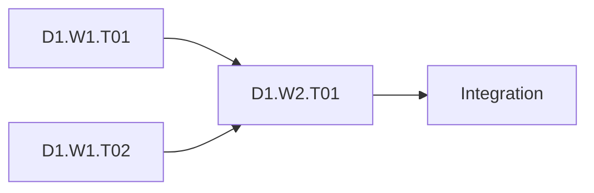

# `<Objective>` — Parallel Sol–Terra Execution Plan

> Use this template when the objective decomposes into independently verifiable work. **Parallel** is a topology choice. The project consultation tier and the optional **Assured** overlay are independent decisions. For one coupled linear operation, use `compact-direct-trace.md`; for Parallel+Assured, attach `assured-ledger.md`.

## 1. Plan identity and operating contract

| Field | Value |
|---|---|
| Plan ID | `<stable project/plan ID>` |
| Current revision | `Revision 0 — Baseline and Scope` |
| Work ID namespace | `w:<plan-id>:<task-id>`; stable across retries/transports; no secrets or raw user content |
| Attempt identity | `<work-id>@a<N>`; one fenced active owner; native run IDs recorded beneath it |
| Lifecycle contract | `planned → ready → dispatched → running → handoff_pending → verified`; see `references/work-item-lifecycle.md` |
| Kanban bootstrap root (when selected) | `<board>/<card id>/<idempotency key>; goal_mode=false>` |
| Lifecycle authority | `Kanban graph: cards, links, runs, events, comments, and attachments` |
| Trace reconciliation snapshot | `<timestamp + root/card readback; informational only, never a second status writer>` |
| Controller | `<configured controller model/provider/reasoning readback>` |
| Delegated worker | `<configured child model/provider/reasoning readback>` |
| Worker role | `leaf; no grandchildren` |
| Topology | `Parallel` |
| Transport policy | `delegate_task \| kanban \| mixed-by-lane` |
| Project consultation tier | `exempt \| standard \| broad \| high-risk` |
| Assured overlay | `OFF \| ON` |
| Assured ledger | `<linked ledger ID/path or N/A>` |
| Capacity source | `<live configuration/tool-exposed maximum and readback evidence>` |
| Created / updated | `<ISO timestamps>` |

### Current scheduling behavior

The current model-facing behavior is **batch scheduling**: the controller submits one delegation batch for each dependency-ready wave, including all ready independent leaves up to the live configured/tool-exposed concurrency maximum. The controller never invents work to fill capacity, never dispatches conflicting leaves together, and treats dispatch as pending until the genuine batch-completion event is received. A later wave is formed only after controller verification of the prior wave. For a non-trivial Kanban project/integration, create or reuse the `goal_mode=false` bootstrap root, attach this trace, and read back the complete child DAG before dispatching any execution worker.

Do not hard-code a worker count or a fixed duration target. Use the capacity read back from the installed configuration and tool at plan time; if capacity is unavailable or inconsistent, block dispatch and record the exact evidence.

## 2. Objective, scope, and constraints

**Requested outcome:**  
`<one precise, observable final result>`

**Why it matters:**  
`<user/business/technical value>`

**Authoritative sources:**

- `<user requirement or contract>`
- `<repository/system source and current-state evidence>`
- `<relevant decision, test, or live query>`

### In scope

- `<deliverable or behavior>`

### Exclusions

- `<explicitly excluded outcome, path, system, deployment, or cleanup>`

### Constraints and invariants

- `<safety, privacy, compatibility, ownership, or process constraint>`
- `<No fixed duration target; completion depends on evidence and gates.>`
- `<No two active leaves may mutate the same resource or overlapping records.>`
- `<Unclear destructive scope, identity, or prerequisite fails closed.>`
- `<Controller owns planning, routing, integration, and final verification; leaves execute only assigned atomic work.>`

### Assumptions

| ID | Assumption | Evidence | Impact if false | Resolution owner | State |
|---|---|---|---|---|---|
| A1 | `<assumption>` | `<source/readback>` | `<specific impact>` | `<Sol/user/task>` | `open \| confirmed \| rejected` |

## 3. Topology, tier, and overlay decisions

**Why Parallel:** `<independence, disjoint ownership, and separate verification evidence for the workstreams>`  
**Why not Direct:** `<why serial controller execution would conceal safe independent work or create unnecessary coupling>`  
**Project tier:** `<exempt/standard/broad/high-risk plus evidence; tier is not inferred from Parallel>`  
**Assured overlay:** `<OFF or ON plus reason; Assured adds proof/state traceability and does not replace the topology>`

### Routing pre-flight gate

Inspect applicable fields from supported runtime surfaces before dispatch. Separate requested and observed values; mark optional untraced telemetry `UNKNOWN`. Required capabilities and explicit user route pins must be verified.

| Field | Expected/current value | Readback source | Status |
|---|---|---|---|
| Controller model/provider/reasoning | `<requested and observed; untraced values unknown>` | `<config/tool/session evidence>` | `PASS \| UNKNOWN-OPTIONAL \| BLOCKED-REQUIRED` |
| Child model/provider/reasoning | `<requested and observed; adaptive proof only if required>` | `<delegation resolver/runtime evidence>` | `PASS \| UNKNOWN-OPTIONAL \| BLOCKED-REQUIRED` |
| Child role and spawn depth | `leaf; no grandchildren` | `<tool/runtime evidence>` | `PASS \| BLOCKED` |
| Maximum concurrent children | `<live configured/tool-exposed maximum>` | `<config/tool readback>` | `PASS \| BLOCKED` |
| Batch completion event contract | `<event/handle format>` | `<tool evidence or N/A before dispatch>` | `PASS \| BLOCKED` |
| Kanban orchestrator tools | `<enabled/disabled/N/A>` | `<live schema evidence>` | `PASS \| BLOCKED \| N/A` |
| Named board/dispatcher | `<slug + gateway singleton evidence>` | `<supported readbacks>` | `PASS \| BLOCKED \| N/A` |
| Kanban profile/workspace contract | `<profiles, routes, workspaces>` | `<catalog/card evidence>` | `PASS \| BLOCKED \| N/A` |

If an explicit route pin or required capability, leaf/depth boundary, ownership, or capacity cannot be verified, block that lane and record the exact missing fact. Optional untraced effort/adaptive telemetry is not a model-selection or login prerequisite. Continue on the current supported route, or use Direct when safe and compatible with explicit constraints; never guess or edit global routing.

## 4. Requirement traceability

| Requirement ID | Requirement | Authoritative source | Deliverable/task IDs | Verification | Kanban readback snapshot |
|---|---|---|---|---|---|
| RQ-01 | `<requirement>` | `<source>` | `<task IDs>` | `<binary check>` | `<board/card IDs + timestamped observed state>` |

Every requirement maps to at least one atomic leaf, and every leaf maps back to at least one requirement. A requirement is not covered by a vague integration task.

## 5. Decomposition and atomicity

Use a complete tree from the objective to independently verifiable leaves:

```text
L0 Objective
└── D1 Deliverable
    ├── W1 Work package
    │   ├── D1.W1.T01 Atomic leaf
    │   └── D1.W1.T02 Atomic leaf
    └── W2 Work package
        └── D1.W2.T01 Atomic leaf
```

For every non-leaf, record why its children are collectively complete, non-overlapping, and sufficient. Split recursively until every leaf has:

- one concrete outcome and one owner;
- explicit authoritative inputs and one named artifact/side effect;
- no hidden prerequisite or unlisted internal deliverable;
- exact read/write ownership boundaries;
- one explicit acceptance check deciding completion;
- isolated failure impact; and
- a focused size appropriate to one delegation, or one indivisible coherent operation.

Do not split a transaction, migration, tightly coupled edit, or state transition merely to create more children.

## 6. Coherent task registry

| Task ID | Work ID | Attempt ID | Parent | Requirement IDs | Outcome | Transport / native execution ID | Lifecycle state | Depends on | Unlocks | Owner boundary | Acceptance check | Kanban card/readback | Revision lineage |
|---|---|---|---|---|---|---|---|---|---|---|---|---|---|
| D1.W1.T01 | `w:<plan>:D1.W1.T01` | `@a1` | `<parent>` | `RQ-01` | `<one outcome>` | `delegate_task:<delegation>/<child> \| kanban:<board>/<card>/<run>` | `planned \| ready \| dispatched \| running \| handoff_pending \| verified \| blocked \| failed \| cancel_requested \| cancelled \| unknown \| superseded` | `—` | `<IDs>` | `<exact paths/resources>` | `<binary check>` | `<timestamped card/run state>` | `R0` |

Include every required consultation as an explicit atomic task with `Mode: required` in its card. Consultation coverage must not be represented by an unassigned note.

### Required task-card schema

Repeat for every registry row; do not omit fields.

#### `<TASK-ID>` — `<short name>`

- **Work ID / attempt:** `w:<plan-id>:<task-id> / <work-id>@a<N>`
- **Plan revision:** `<Revision N — milestone>`
- **Lifecycle state:** `planned | ready | dispatched | running | handoff_pending | verified | blocked | failed | cancel_requested | cancelled | unknown | superseded`
- **Transport:** `delegate_task \| kanban`
- **Transport identity:** `<delegation + child ID, or board/card/run/idempotency/assignee/workspace mapping>`
- **Parent requirement(s):** `<RQ IDs>`
- **Objective:** `<one concrete outcome>`
- **Why it matters / unlocks:** `<downstream dependency>`
- **Authoritative inputs:** `<exact paths, facts, handles, or URLs>`
- **Verified dependencies:** `<predecessor IDs and outputs>`
- **May read:** `<exact resources>`
- **May modify:** `<exact resources>`
- **Must not modify:** `<sibling-owned and out-of-scope resources>`
- **Deliverable/side effect:** `<artifact or observable result>`
- **Acceptance criteria:**
  - [ ] `<binary criterion>`
  - [ ] `<binary criterion>`
- **Verification:** `<exact command/query/readback>`
- **Failure impact:** `<what remains valid and what is blocked>`
- **Rollback/cleanup:** `<exact action or N/A>`
- **Kanban readback:** `<timestamped card/run/event state; this trace does not write lifecycle status>`
- **Evidence:** `<pending or exact result>`
- **Steering/guidance:** `<N/A, or sequence + redacted intent + target + queued/landed/missed/rejected/not-live disposition>`
- **Checkpoint:** `<minimal facts, artifact/input fingerprints, native IDs, and unresolved blocker; never raw transcript or secret>`
- **External agent assistance:**
  - **Mode:** `prohibited \| optional \| required`
  - **Allowed CLIs:** `Codex \| Claude Code \| both \| none`
  - **Purpose:** `<implementation critique, optimization, independent review, adversarial review, or N/A>`
  - **Permissions:** `read-only \| bounded edits to <exact owned paths>`
  - **Budget:** `<maximum calls and turns; no unbounded retry>`
  - **Required evidence:** `<loaded skill, command class, exit status, findings, changed paths>`

## 7. Dependency DAG and ownership

### DAG



**Actual dependency edges:** `<one edge per line: task A -> task B>`

### DAG gate

- [ ] Every dependency references an existing task.
- [ ] The graph is acyclic.
- [ ] Every blocked task names its blocker.
- [ ] Every ready task has all dependencies `verified`.
- [ ] No task depends on unrecorded output, an implicit parent transcript, or an unverified external effect.

### Mutable-resource ownership

| Resource/handle | Type | Wave owner | Other readers | Conflict control | Cleanup owner |
|---|---|---|---|---|---|
| `<path, record, device, account, branch, process>` | `<file/record/device/etc.>` | `<task ID>` | `<task IDs>` | `disjoint \| isolated \| serialized` | `<task ID>` |

No two active leaves may own overlapping mutable resources. Read-only sharing is allowed only when it cannot observe unsafe intermediate state.

## 8. Ready queue and batch waves

### Ready-queue algorithm

1. Recompute after every verified wave or material state change.
2. Include only tasks whose dependencies are `verified`, whose ownership is conflict-free, and whose preconditions pass.
3. Order by critical-path impact, then downstream unlocks, then risk reduction, then stable task ID.
4. Partition ready tasks by selected transport. Dispatch the delegate batch up to its verified capacity. For a non-trivial Kanban project/integration, create/reuse and read back its bootstrap root plus complete child graph before dispatch; otherwise create/reconcile only the explicitly selected Kanban cards after their board/profile/workspace preflight.
5. Do not dispatch future waves provisionally; they become eligible only after controller verification.

**Current capacity readback:** `<live value/source>`  
**Current ready queue:** `<ordered task IDs>`  
**Queue gate:** `PASS \| BLOCKED`

### Wave `<N>` — `<descriptive milestone>`

| Field | Value |
|---|---|
| Entry gate | `<verified prerequisite and ownership evidence>` |
| Ready tasks included | `<all selected task IDs in this batch>` |
| Batch size | `<computed from ready count and live capacity; never a hard-coded target>` |
| Expected unlocks | `<task IDs>` |
| Delegation/batch ID | `<pending or event ID>` |
| State | `planned \| dispatched \| running \| handoff_pending \| verifying \| verified \| blocked` |

| Slot/order | Task ID | Owner boundary | Acceptance/verification | Worker result | Controller verdict |
|---:|---|---|---|---|---|
| 1 | `<task ID>` | `<exact resources>` | `<binary check>` | `pending` | `pending` |

A batch return is not completion. Wait for the genuine completion event, then independently verify every returned result before recording the task as `verified`.

### Kanban mapping and reconciliation snapshot

| Plan task | Work ID | Attempt | Board | Card | Native run | Idempotency key | Assignee route | Workspace | Parent cards | Card/run state | Root/graph readback | Reconciliation evidence |
|---|---|---:|---|---|---|---|---|---|---|---|---|---|
| `<ID>` | `w:<plan>:<task>` | `<N>` | `<slug>` | `<t_id>` | `<run>` | `<plan>:<task>:<creation-attempt>` | `<profile/model/provider/reasoning/skills>` | `<kind/path/project>` | `<IDs>` | `<state/run>` | `<root/card timestamped snapshot>` | `<readback>` |

Rules: Kanban is the lifecycle authority for a Kanban-native project/integration; create/reuse its `goal_mode=false` bootstrap root before child creation/dispatch; attach this trace to the root; use a distinct final-synthesis fan-in card; one active transport per attempt; parents at creation; read back each card before dependent creation; reconcile partial fan-out by idempotency key; no worker-created plan cards; no auto-decompose/swarm; trace snapshots never write or override card state; transport handoff requires prior-owner fencing and a new attempt identity.

### Kanban recovery ledger

| Task/card | Event | Prior owner fenced | Partial effects read back | Decision | Successor attempt/transport | Evidence retained |
|---|---|---|---|---|---|---|
| `<ID/card>` | `blocked \| timeout \| crash \| reclaim \| reassignment \| request_changes \| gave_up \| missing` | `YES/NO` | `<readbacks>` | `wait \| repair \| reassign \| handoff \| abort` | `<identity or N/A>` | `<runs/comments/artifacts>` |

## 9. Self-contained execution-leaf brief schema

Every leaf receives a complete brief because it has no parent transcript. Fill every field and pass paths rather than pasting large files.

```text
ROLE
You are the configured execution leaf. Under delegate transport, use the verified Terra route; under Kanban, use the exact validated assignee profile and its verified route. Execute exactly one atomic assignment. Do not create grandchildren, create plan child cards, or return a plan instead of doing the work.

WORK ID / PLAN TASK ID / REVISION / ATTEMPT
w:<plan-id>:<task-id> / <stable plan task ID> / <Revision N — descriptive milestone> / <work-id>@a<N>

TRANSPORT IDENTITY AND LIFECYCLE
<delegation ID + subagent ID, or Kanban board/card/run/idempotency/profile/workspace mapping>
Begin in `dispatched`; report only a handoff. The controller alone may record `verified` after independent checks. A live `delegate_task` steer is valid only when active, exact-child, and scope-preserving. Kanban comments are durable guidance, not proof an in-flight worker received them.

OBJECTIVE
<one concrete outcome>

WHY IT MATTERS
<parent requirement and downstream tasks unlocked>

AUTHORITATIVE CONTEXT
<requirements, decisions, exact relative paths, source links, and current state>

DEPENDENCIES
<verified predecessor IDs and their outputs; state N/A only when truly none>

OWNERSHIP BOUNDARY
May read: <exact resources>
May modify: <exact resources>
Must not modify: <siblings, secrets, global config, or out-of-scope resources>

DELIVERABLE
<exact artifact or observable side effect>

ACCEPTANCE CRITERIA
- <binary criterion 1>
- <binary criterion 2>

VERIFICATION
<exact commands, queries, or readback handles; include expected exit/status>

ROLLBACK/CLEANUP
<exact action or N/A with reason>

EXTERNAL AGENT ASSISTANCE
Mode: prohibited | optional | required
Allowed CLIs: Codex | Claude Code | both | none
Purpose: <bounded purpose>
Permissions: read-only | bounded edits to <exact owned paths>
Budget: <maximum calls/turns>
Required evidence: loaded skills, command class, exit status, concise findings, changed paths

OUTPUT CONTRACT
Return exactly:
1. Work ID / attempt / transport identity
2. Status: PASS, BLOCKED, or FAILED
3. Result
4. Evidence from real execution
5. Exact files/resources changed (or none)
6. Steering/guidance disposition, deviations, risks, newly discovered work, and cleanup state
```

## 10. Consultation coverage

Risk classification is mandatory and independent of topology/Assured. Standard/Broad CLI reviews default to optional unless the user/task explicitly requires them; High-risk and explicitly required named reviews remain completion gates.

| Tier | Trigger | Consultation mode and evidence |
|---|---|---|
| Exempt | No behavior/source/test/build/config/data/public-output change, or mechanical documentation change proven semantically identical | No consultation; do not create quota-filling calls |
| Standard | Bounded behavior/config change with limited blast radius | Optional useful available CLI; explicitly required assignments follow named-review/fallback rules |
| Broad | Multi-component, public-contract, multi-leaf, or materially cross-cutting change without a high-risk trigger | Optional Codex/Claude perspectives; explicitly required named reviews remain mandatory |
| High-risk | Auth, security, concurrency, migration, data integrity, production control, irreversible operation, or broad blast radius | Both CLIs independently review the exact final artifact; fingerprints must match |

**Classification evidence:** `<facts and source>`  
**Project ID:** `<stable ID>`  
**Selector command/evidence:** `<relative helper command or ledger record>`  
**Required consultation task IDs:** `<atomic IDs whose cards say Mode: required>`  
**Regression status:** `incomplete | failed | passed`  
**Regression evidence:** `<exact deterministic commands and real results>`  
**Review eligibility fingerprint:** `<SHA-256 only after deterministic checks pass>`  
**Repair scope:** `<changed behavior/files and relevant dependents; N/A for initial review>`  
**Fallback/waiver:** `<N/A, permitted standard fallback, or user-only waiver with disclosed risk>`

| Consultation task ID | CLI | Mode | Purpose | Permissions | Call/turn budget | Fingerprint | Result/evidence | Independent verification |
|---|---|---|---|---|---|---|---|---|
| `<task ID>` | `Codex \| Claude` | `required \| optional` | `<bounded purpose>` | `<read-only/bounded exact paths>` | `<limits>` | `<SHA-256/N/A>` | `<status and result>` | `<controller evidence>` |

Sequencing and reuse rules:

- Deterministic acceptance/regression checks must pass before a review is dispatched. Required review may remain pending while those checks complete, but it cannot block deterministic execution.
- Record consultation metadata only; never store prompts, secrets, source text, credentials, or raw output in the ledger.
- If the fingerprint is unchanged, reuse successful evidence. If it changes materially, rerun deterministic checks; required coverage needs a budgeted delta review naming changed behavior/files and relevant dependents. Unused optional evidence stays marked stale.
- Use a finite project call/turn budget, normally one initial plus up to two evidence-backed delta reviews per selected CLI, within existing authorized scope/cost. Continue within it without routine approval. Exhaustion triggers Chairman reassessment, not a reset or silent extra call; required evidence stays pending. No identical prompts, quota-filling calls, or unrestricted reviews.
- Record optional unavailability as `UNAVAILABLE_OPTIONAL` in the plan (`unavailable` in the helper), disclose missing coverage, and continue without login prompts. Never reclassify a required review to optional because it failed.
- If required evidence is unavailable or fails, final completion is `BLOCKED` unless the tier explicitly permits a documented fallback or the user grants the required waiver.

**Coverage verdict:** `PASS \| BLOCKED \| OPTIONAL_ONLY \| EXEMPT \| WAIVED_CONDITIONAL` (a waiver or unrun review is never PASS)

## 11. Worker evidence and controller verification

### Wave `<N>` result

- **Completion event:** `<ASYNC DELEGATION BATCH COMPLETE — event/batch ID>`
- **Worker summaries received:** `<count and task IDs; reconcile against dispatched IDs>`
- **Worker evidence:** `<commands, exit statuses, artifacts, hashes, readbacks>`
- **Files/resources changed:** `<exact list>`
- **Deviations/new work:** `<none or traced task IDs>`

### Controller verification table

| Task ID | Spec gate | Quality/integration gate | External readback | Evidence | Final task state |
|---|---|---|---|---|---|
| `<task ID>` | `PASS \| FAIL` | `PASS \| FAIL` | `PASS \| N/A \| FAIL` | `<controller commands/queries>` | `verified \| failed \| ready \| blocked` |

Worker claims are evidence leads, not proof. The controller must read changed artifacts/diffs, run the named checks, verify ownership and scope, and confirm all material side effects in the authoritative system.

## 12. Incremental updates and structural revision history

After every completed batch, including a successful batch, update this plan before dispatching again.

### Revision `<N>` — `<descriptive milestone>`

**Trigger:** `verified wave \| failed acceptance \| new evidence \| changed requirement \| external mutation mismatch \| routing drift`  
**What became true:** `<fact established by evidence>`  
**What changed and why:** `<scope, task, dependency, ownership, evidence, or status change>`

- **Completed tasks:** `<IDs>`
- **Failed/blocked/cancelled tasks:** `<IDs and exact reasons>`
- **Added tasks:** `<new atomic IDs and requirement mapping>`
- **Revised attempts:** `<old ID -> new revision-suffixed ID; preserve old history>`
- **Removed work:** `<cancelled IDs and reason; never erase history>`
- **DAG changes:** `<edges added/removed and acyclicity evidence>`
- **Ownership changes:** `<resource claims and conflict proof>`
- **New ready queue:** `<ordered IDs>`
- **Next batch:** `<computed from live capacity and ready queue>`
- **Consultation/fingerprint effect:** `<reused, invalidated, or delta review required>`
- **Completeness gate:** `PASS \| BLOCKED`

### Structural revision triggers

Create a new revision, re-run the completeness gate, and do not silently patch history when any of these occurs:

- a requirement, boundary, assumption, or acceptance criterion changes;
- worker evidence contradicts the plan or reveals a hidden dependency;
- a task is not atomic, has a new deliverable, or requires a new owner/resource;
- a dependency, wave membership, or mutable-resource claim changes;
- a material artifact change invalidates a consultation fingerprint;
- a side effect is partial, mismatched, unknown, or requires rollback;
- routing, capacity, adaptive resolver behavior, or batch completion semantics drift; or
- a task reaches the repair-attempt limit or needs a user decision.

Preserve every task card, attempt, result, failed check, and earlier revision. Use stable IDs with revision suffixes for repairs; never overwrite a failed attempt.

## 13. Escalation and abort

- **Pre-flight block:** invalid routing, missing context, incomplete decomposition, cyclic DAG, or ownership conflict. No dispatch.
- **Repair gate:** acceptance fails; create a focused revision-suffixed repair leaf and re-verify. Declare a finite repair budget, normally three attempts per tactic. On exhaustion or non-improvement, stop the tactic and re-plan internally; a materially different new tactic needs evidence and unchanged authorized scope/cost/risk, not routine user feedback.
- **Escalation gate:** conflicting requirements, unisolatable ownership, missing authoritative dependency, ambiguous destructive scope, or user-only waiver. Ask for one concrete decision.
- **Abort gate:** safety boundary violation, unauthorized mutation, identity mismatch, irreconcilable state, or unknown irreversible effect. Stop, preserve evidence, and record rollback/cleanup status.

## 14. Integration and completion gates

### Plan-completeness gate

- [ ] Every requirement has forward and reverse traceability.
- [ ] Every leaf passes the atomicity checks and has one owner and one binary acceptance check.
- [ ] The DAG is complete and acyclic.
- [ ] Same-wave mutable-resource ownership is disjoint or safely isolated.
- [ ] Relevant success, failure, cancellation, rollback, cleanup, teardown, hostile-input, concurrency, zero/one/many, and auth states are represented.
- [ ] Routing, child role, spawn depth, capacity, and batch-event semantics are read back.
- [ ] Transport choice is recorded per attempt; no task has two live transport owners.
- [ ] Kanban lanes have verified toolset, board, dispatcher, profiles/routes, workspace, parent/idempotency mapping, lifecycle, and evidence retention.
- [ ] Consultation assignments are explicit, correctly tiered, and bound to task cards.

**Plan-completeness verdict:** `PASS \| BLOCKED`

### Final integration gate

- [ ] Every requirement maps to a `verified` leaf.
- [ ] All outputs integrate without contradiction or unowned changes.
- [ ] End-to-end, neighboring, and regression checks pass as applicable.
- [ ] Required consultation coverage is `PASS`, or a permitted fallback/user waiver is documented and independently verified.
- [ ] Every high-risk review fingerprint matches the exact final accepted artifact; no material post-review change remains unreviewed.
- [ ] Every external side effect has an authoritative readback matching intent.
- [ ] Rollback, cleanup, process teardown, and capability revocation obligations are complete.
- [ ] No unexplained `dispatched`, `running`, `handoff_pending`, `blocked`, `failed`, `unknown`, or pending task/state remains.
- [ ] Every Kanban card is terminally reconciled, verified by Sol, and archived/retained only after artifact, run-history, rollback, and cleanup obligations close.
- [ ] The final trace snapshot is reconciled from the accepted Kanban root/final-synthesis readback; no artifact writes or overrides lifecycle state.

**Final verification commands/queries:**

```text
<exact commands and authoritative queries>
```

**Final evidence:** `<real outputs, artifact paths, hashes, URLs, IDs, and readbacks>`  
**Completion verdict:** `PASS \| BLOCKED \| ABORTED`  
**Completed at:** `<ISO timestamp>`
